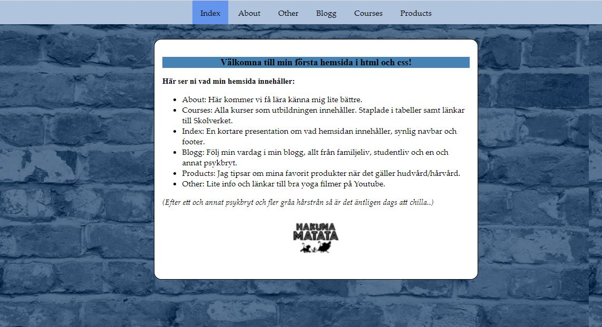

# Portfolio

Här kan ni hitta olika projekt jag har gjort under min utbildning till Webbutvecklare, Campus Mölndal 2021-2022

## Webbutveckling_1

Min första inlämning där man skulle skapa flera olika HTML-sidor (about, courses, index, blogg, products, other), alla
sidor ska ha en navbar och en footer. Sidan ska även vara responsiv (media queries mobile/table/desktop)

## Programmering_1

Vi har lärt oss lite grunder i JavaScript. Denna inlämning innehåller en webshop med album

* Visa vilka album som finns
* Lägga till album i en kundkorg
* Ta bort album i en kundkorg
* Uppdatera antalet album i en kundkorg

### Digitalt_skapande

Här skulle vi bekanta oss med olika sätt att arbeta kring skapande. Jag valde att använda mig av foto/gif/ljud.

### Gränssnittsdesign

Vi skapade en sida med uttänkt UX/UI, även personas skulle finnas, wireframe och en prototyp i färgskala.

### Webbutveckling_2

Nu ska vi återskapa inlämingen från programmering_1 men nu är den översatta till React och med JavaScript. Det ska
fortfarande finnas med UX/UI tänk samt prototyper.

### Webbserverprogrammering

Vi har skapat en enklare Backend med ett RestApi som kopplar till en frontend. (Inget fokus på frontend denna inlämning)
Api:t innehåller en to-do-list enligt CRUD. Det finns även enkla tester i Insomnia, enkla frontend tester samt tester i
backend. Använt Node.js och React.js, det är en express server.

### Datalagring

Nu ska vi återskapa inlämningen från förra kursen Webbserverprogrammering. Istället för att använda oss av ett RestApi,
så har vi kopplat på Docker, MongoDB, Mongoose och React. Det följer fortfarande CRUD, finns tester på backend/frontend
och Insomnia. Inprincip är detta ett FullStack projekt.

### FullStack (Pågående)

Vi ska skapa ett FullStack projekt i grupp men temat BookFace, med en inloggning och en meddelande funktion. Detta är
fortfarande pågående och kommer upp inom kort. Hela inlämningen ska vara skriven i TypeScript.
